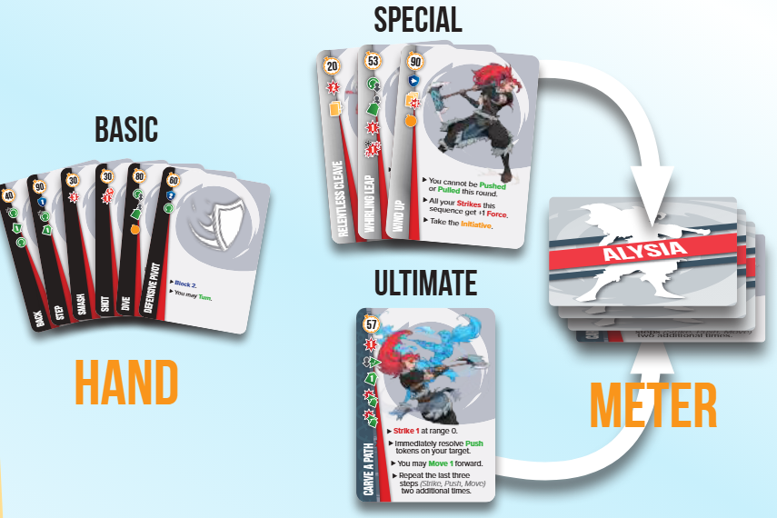

# Actions

1. Efectos de acción
2. Anatomía de cartas de acción
3. Tipos de acciones
   1. Moverse
   2. Girarse
   3. Atacar
   4. Bloquear

## 1. Efectos de acción

Al activar una carta de acción, sus acciones ocurrirán. Se deben leer las acciones de arriba a abajo, además, **es obligatorio que todas sus acciones ocurran en el orden mencionado**.

<figure><figcaption></figcaption></figure>

## 2. Anatomía de cartas de acción

Las cartas de acción tienen diferentes apartados que tendremos que conocer para usarlas.

<figure><figcaption></figcaption></figure>

1. **Nombre**. El nombre de la carta de acción.
2. **Velocidad**. Las cartas de acción que tengan mayor numero de velocidad se jugarán primero.
3. **Grado**. El borde de la carta indicará de que grado es, habiendo 3 tipos: negro _<mark style="color:blue;">(carta básica)</mark>_, **plateado** _<mark style="color:blue;">(carta especial)</mark>_ y con el color de la leyenda _<mark style="color:blue;">(carta definitiva)</mark>_.
4. **Acciones**. Lista de eventos que ocurrirán de forma ordenada al jugar la carta.
5. **Resumen**. Iconos que funcionan como resumen de las acciones. No es obligatorio aprenderlos, pues es mas intuitivo leer las acciones que guiarse por estos iconos.

## 3. Tipos de acciones

Las cartas pueden tener diferentes acciones:

### 🦶 i. Moverse

El movimiento en este juego es esencial, no hay que quedarse quieto atacando únicamente.

Para moverse, tendrás que desplazar al personaje el número de casillas que se indique en la acción de movimiento.

Para moverse de frente o de espaldas, habrá que tener en cuenta la dirección en la que esta mirando el personaje en ese momento.

Si estas en un borde tras haberte movido, se te otorga 1 turno extra para moverte una casilla hacia el centro, ¡si no podrías caerte de la arena!

### ↪️ ii. Girarse

Girarse servirá para saber a donde se moverá tu personaje en caso de ir de frente o de espaldas.

Solo tienes que girar al personaje a la dirección opuesta.

### 👊 iii. Atacar

El ataque es importante, pues aplicarás Fatiga a tus rivales para poder sacarlos de la arena con un Empuje.

Hay dos cosas a tener en cuenta para atacar:

#### 1. Objetivo

Encuentra un objetivo al que atacar:

* Deberás atacar al objetivo más cercano que esté dentro de tu rango de ataque y en la dirección en la que estas mirando.
* En el caso de haber varios enemigos justos, tendrás que atacar al que tenga la menor velocidad en esta ronda.
* Si hay varios enemigos y todos tienen la misma velocidad, tendrás que atacar al que mas fatiga tenga.
* Si se han cumplido todas las condiciones previas, puedes elegir libremente a que objetivo atacar.

_Si no hay ningún objetivo al que atacar, tu ataque no acertara; el resto de acciones de la carta no ocurrirán._

#### 2. Fuerza

Si tu fuerza es menor que su bloqueo:

* Tu ataque no acertará; el resto de acciones de la carta no ocurrirán _(aun así, sigue contando como un golpe)_.
* Tu rival deberá mover su ficha de fatiga un espacio a la derecha _(independientemente de la fuerza del ataque)_

Si tu fuerza es mayor que su bloqueo:

* Resta el valor del bloqueo del rival a tu ataque.
* Con ese resultado y empezando por la ficha de fatiga del oponente, cuenta un número de espacios a la derecha igual a tu Fuerza restante, pero no muevas la ficha de Fatiga.
* Coloca un número de fichas de Empuje sobre el objetivo igual al número de Empuje que  aparece en el icono rojo de ataque. La dirección de las fichas de Empuje coincide con tu orientación.

<figure><figcaption></figcaption></figure>

_El valor del bloqueo es independiente a cada ataque que reciba, no se va restando._

### 🛡️ iv. Bloquear

Para evitar que te saquen de la arena con facilidad, deberás guardar bloqueos.

* Bloquear reducirá la fuerza de los ataques que recibas durante el resto de la ronda.
* Una vez haya acabado la ronda, el bloqueo de la carta no seguirá haciendo efecto.

<figure><figcaption></figcaption></figure>
